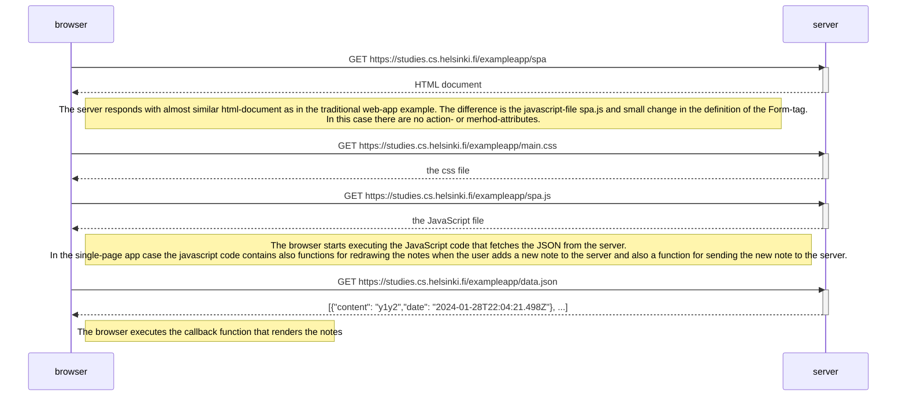

```mermaid
sequenceDiagram
    participant browser
    participant server

    browser->>server: GET https://studies.cs.helsinki.fi/exampleapp/spa
    activate server
    server-->>browser: HTML document
    deactivate server

    Note right of browser: The server responds with almost similar html-document as in the traditional web-app example. The difference is the javascript-file spa.js and small change in the definition of the Form-tag.<br/> In this case there are no action- or merhod-attributes.

    browser->>server: GET https://studies.cs.helsinki.fi/exampleapp/main.css
    activate server
    server-->>browser: the css file
    deactivate server

    browser->>server: GET https://studies.cs.helsinki.fi/exampleapp/spa.js
    activate server
    server-->>browser: the JavaScript file
    deactivate server

    Note right of browser: The browser starts executing the JavaScript code that fetches the JSON from the server.<br/> In the single-page app case the javascript code contains also functions for redrawing the notes when the user adds a new note to the server and also a function for sending the new note to the server.

    browser->>server: GET https://studies.cs.helsinki.fi/exampleapp/data.json
    activate server
    server-->>browser: [{"content": "y1y2","date": "2024-01-28T22:04:21.498Z"}, ...]
    deactivate server

    Note right of browser: The browser executes the callback function that renders the notes 

```