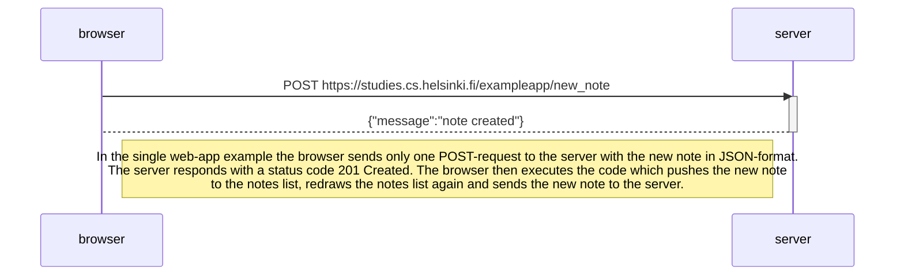

```mermaid
sequenceDiagram
    participant browser
    participant server

    browser->>server: POST https://studies.cs.helsinki.fi/exampleapp/new_note
    activate server
    server-->browser: {"message":"note created"}
    deactivate server


    Note right of browser: In the single web-app example the browser sends only one POST-request to the server with the new note in JSON-format.<br/> The server responds with a status code 201 Created. The browser then executes the code which pushes the new note <br/>to the notes list, redraws the notes list again and sends the new note to the server.

```